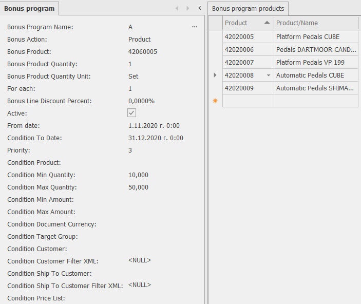

# Bonus Programs

The bonus program is used for offering a bonus - an additional free product or discount, based on the quantities of products or services purchased by the customer.

## Required fields

* **Bonus Program Name**: allows you to enter a unique name of the bonus program
* **Bonus Action**:  allows you to choose whether the bonus is a product or a discount. If you choose a product, you also must fill: **Bonus Product**, **Bonus Product Quantity**, **Bonus Product Quantity Unit**. If you choose a discount, you also must fill **Bonus Line Discount Percent**
* **Bonus Line Discount Percent**: allows you to specify the percentage discount for a sales line. The discount from the bonus program replaces the standard discount. 
* **Bonus Product**: choose the product that is received free of charge if the conditions of the bonus program are fulfilled
* **Bonus Product Quantity**: allows you to specify how much of the bonus product the customer will receive
* **Bonus Product Quantity Unit**: allows you to specify the unit of measure of the bonus product
*  **Condition Product**: allows you to specify a product for the sale of which the current bonus program will apply. If no product is specified and the field is empty, the conditions set in the other fields will be checked for the entire Sales Order. The bonus program can also be applied to more than one product. In this case it is necessary to specify all of the products that are included in the bonus program in the panel **Bonus Program Products**.
* **Priority**:  allows you to determine which bonus program to execute when two or more bonus programs are applicable. Higher numbers give higher priority.
* **Active**: you can specify whether the bonus program is active

## Condition fields

These fields allow you to specify in detail the conditions under which the bonus program will be executed. You can apply conditions for: Min and Max Quantity, Min and Max Amount, From Date, To Date, Customer, Ship to Customer, Target Group, Price List, Document Currency

