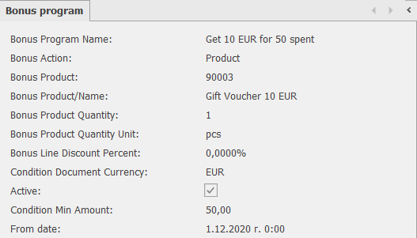
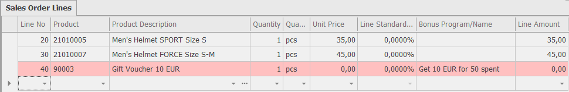
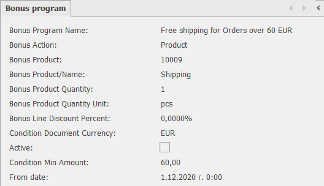
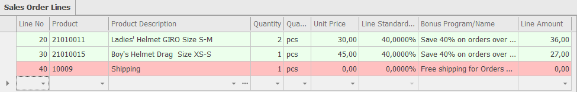

# Bonus Programs

In theory, having a sale is easy enough: Take a service or a product, offer a discount, get new customers, bring in more money. But in practice, sales promotions involve a high level of strategy. Before announcing a sale, you need to consider what type of promotion to offer and when to run it. Should the offer be a discount or a free gift with the purchase? What are the goals of the sale: attracting new customers, introducing new products, moving old inventory?

Here are some examples that can help you decide if @@name is the right solution for your business.

## Get 10 EUR for every purchase above 50 EUR

You can use gift vouchers. They are a great tool for giving bonuses, while ensuring returning customers.  

When the order amount exceeds 50 EUR, the system will automatically add a gift voucher line:

## Save 40% on orders above 60 EUR 

You can give a discount depending of the order total cost and push your customers to put more items in the cart. 

## Free shipping for orders above 60 EUR

You can give free services for larger orders.

## Get 40% off and free shipping for orders above 60 EUR 

You can combine more than one bonus programs in one order and make complex promotions.

