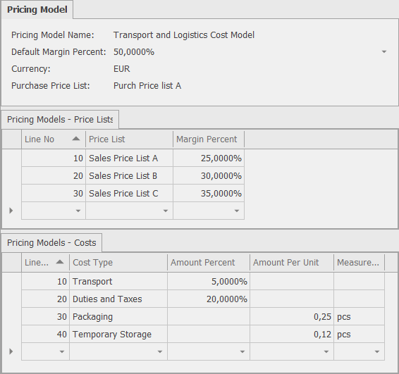

# Pricing

Module Pricing is part of the CRM subsystem of ERP.net and is particularly suitable for commercial companies. With it, you can flexibly create and manipulate prices.

The module is extremely versatile and offers a variety of settings, including automatically calculating prices with a preset formula. For example, the method of calculating the selling price can be set according to corporate policy.

With it, you can simultaneously handle multiple price lists en masse for many products. You will also be able to set in advance the purchase price list and the cost of acquisition of the product, as well as planned profits. It also allows you to use an individual pricing method for each product group separately.

Users can specify the volume of products and price lists with which to work. Each price list in the company can be managed individually, and managers can directly compare current prices and new prices after pricing.
