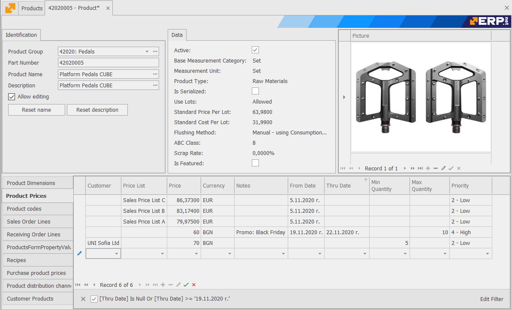

# Products

Products are the basis of your business, the goods or services that you trade in. Each product must be registered as a product card.

Product cards hold the information that is required to buy, sell and account for products.

## Panels

* **Identification**: allows you to set basic information such as Part Number, Product Group and Product Name
* **Data**: allows you to set additional information such as Product Type, Costing Method, Measurement Unit, etc. 
* **Product Codes**: allows you to set the cross-reference between the Product Code that you use for a product and the Product Code that the supplier or customer of that product uses. It is also used to enter a Barcode information.
* **Product Dimensions**: allows you to set the different units of measurement of the product
* **Product Pictures**: allows you to save one or more product images
* **Product Prices**: allows you to set the sales prices of the selected product
* **Line Discount**: allows you to set t the sales discounts of the selected product
* **Product Distribution Channels**: allows you to specify through which distribution channels the product is sold
* **Purchase Product Prices**: allows you to set the purchase prices of the selected product
* **Bonus Programs**: allows you to set up a bonus - an additional free product or discount, based on the quantities of products or services purchased by the customer.
* Bonus Program Products: 
* Customer Products: 
* Default Store Bins 
* Lots: 
* Serial Numbers:
* Recipes:
* Product Structure:
* Product Structure – Material:
* Catalog Description HTML:
* Product Supply:
* Shop Floor and Procurement Planning:
* Product Document Amounts:
* Available Quantities:
* Current Stock Holds:
* **Offer Lines**: contains information about the offer lines for the selected product
* **Sales Order Lines**: contains information about the sales order lines for the selected product
* **Shipment Order Lines**: contains information about the shipment order lines for the selected product
* **Shipment Lines**: contains information about the shipment lines for the selected product
* **Invoice Lines**: contains information about the invoice lines for the selected product
* **Purchase Order Lines**: contains information about the purchase order lines for the selected product
* **Receiving Order Lines**: contains information about the receiving order lines for the selected product
* **Purchase Invoice Lines**: contains information about the purchase invoice lines for the selected product
* **Store Order Lines**: contains information about the store order lines for the selected product
* **Transaction Lines**: contains information about the transaction lines for the selected product

