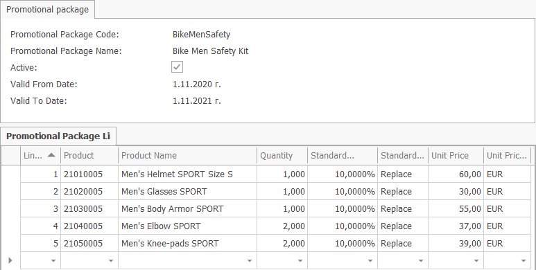

# Promotional Packages

A promotional package is a combination of goods or services sold to consumers in a single package. Usually the products in a promotional package are complementary to each other.

One of the core strengths of a good business information system is the ability to make promo sales not just effective but also super easy.

Promotional packs can help you clear out old products, get current customers to buy new products or simply give time-limited offer incentives to increase sales.

## Benefits of promotional packages

Typically, promotional packages or “Product Bundles” will give customers a discount on goods that they may have been inclined to buy separately at a higher cost. The bundle offers the customer more value and also makes their buying journey a lot easier.

Promotional packages can save retailers money on marketing and distribution by allowing the customer to purchase multiple products with one transaction.

That's not all - when done right, promotional packages also helps keep inventory moving along at a healthy rate. Products that are slowing down in sales or frozen stock can get a boost by being paired with relevant, sales-driving items.

