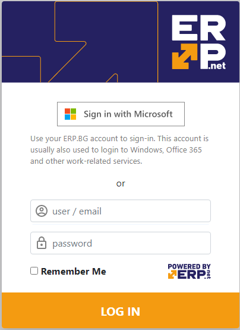

# Single Sign-On via Microsoft Entra ID Integrated Login

Integration of Microsoft Entra ID (formerly known as Microsoft Azure Active Directory /Azure AD/) login provides single sign-on (SSO) for companies which manage their security with Microsoft Entra ID.

> Microsoft Entra ID is the Internet version of the popular Windows Domains. 
> It is hosted (and secured) by Microsoft on behalf of the organizations.  

Utilizing the Entra ID account sign-in, your company can benefit in many ways, including:

* Single Sign-On for your work accounts. 
Users no longer need to have separate passwords for the ERP and other work-related resources. 
* Use your existing security infrastructure. 
Directly utilize your Entra ID setup. 
* No longer store passwords in the ERP. 
* Directly apply domain security policies (MFA, complexity, etc.) to the login security of the ERP.  

