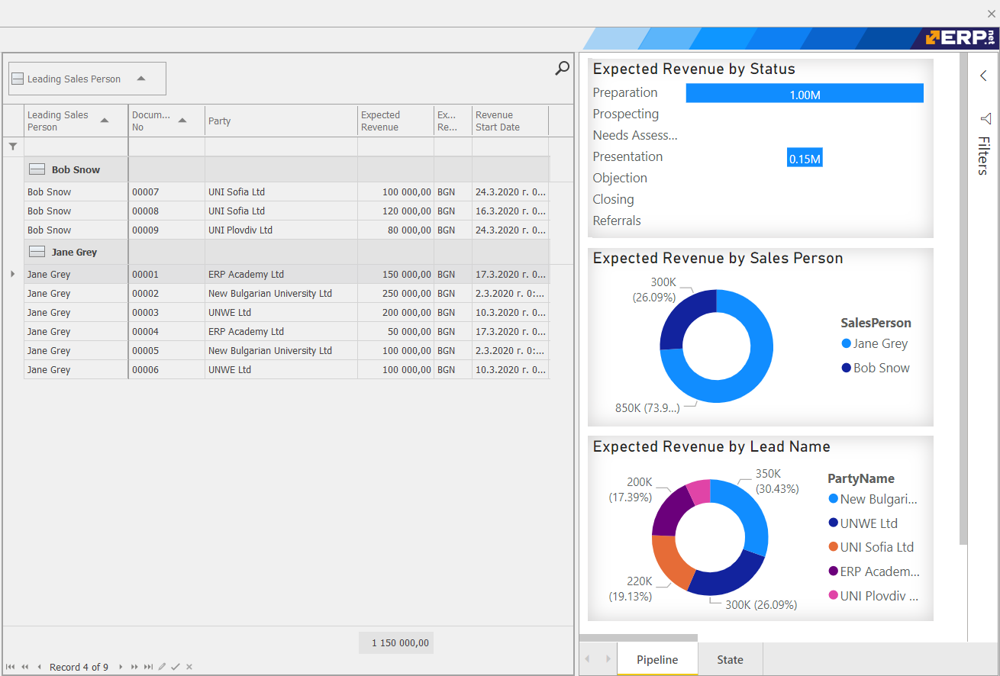

# WebView

WebView allows integration of web-based apps in the main UI client.

## Single sign-on

WebView shares the sign-in token between the main UI client and the web app.
This has many benefits:

* The user enters credentials only once.
* The end user might not even realize they are using multiple apps.
* Only a single license session is consumed for the main UI and all integrated apps.

## Context integration

WebView apps can be context integrated, based on parameters.
This usually means, that the web app can show information, relevant to the current screen.

For example, when opening:

* a customer - a BI web page can show some relevant BI dashboard about the customer.
* a vehicle - web view can easily be integrated with the maintenance service for the car, even if it was not purposely built for @@name integration.
* a sales order - can open a relevant web app which, for example, manages lot expiry dates and automatically selects lots for the lines.

Context integration allows all applications to work seamlessly for the end user as one application.
